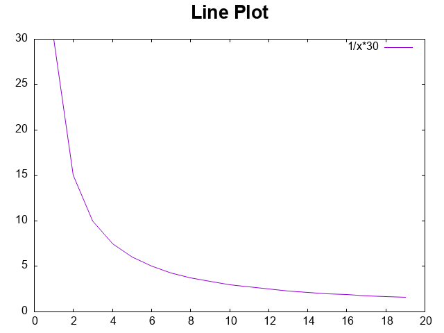
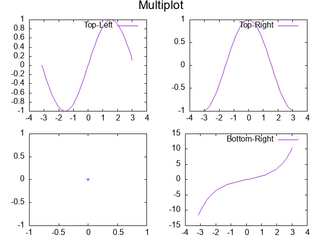

Plotpp
======

A plotting library for C++ that uses Gnuplot as a backend.

Allows plotting from custom containers/vectors if they use `begin()` and `end()` iterators as well as plotting from built in arrays.

Requirements
============
- Gnuplot: [Homepage](http://gnuplot.info/index.html) [Windows Download](https://sourceforge.net/projects/gnuplot/files/gnuplot/) [Linux install](https://riptutorial.com/gnuplot/example/11275/installation-or-setup):  
	*Note: The project can be build without gnuplot,
	since this library will only communicate with gnuplot through pipes. 
	But you will need gnuplot to display the graphical plots.*
- C++20

Dependencies
------------
All dependencies are managed by the [CMake](https://cmake.org/) scripts and use [CPM](https://github.com/cpm-cmake/CPM.cmake)
to manage the dependencies. The dependencies will be automatically downloaded, build and linked to the project.
- {fmt}: [GitHub](https://github.com/fmtlib/fmt), [Documentation](https://fmt.dev/11.0/)

Features
========
### Plotting Styles
- Line
- Poins/Scatter/XError/YError/XYError
- Arrows/Vectors/Quiver
- Heatmap
- Boxes
- Boxplot
- Circle(TODO: s)
- TODO: Pie-Charts

### Figure Styles
- Labeled x axis
- Logarithmic axes

Examples
========

You can see all examples in the `examples/` folder.

Line Plot
---------

```C++
int main() {
	using namespace plotpp;
	
	{
		std::vector<double> x(20);
		for(size_t i=0; i < x.size(); ++i) x[i] = i;
		
		std::vector<double> y1(20);
		for(size_t i=0; i < y1.size(); ++i) y1[i] = 1./i*30;
		
		Figure fig("Line Plot from XY");
		fig.add(line(&x, &y1).label("1/x*30"));
		fig.show();
	}
}
```


Arrow Plot
----------

```C++
int main() {
	using namespace plotpp;
	
	double arrow_x1[] = {-1, -2, -3, -4, -5};
	double arrow_y1[] = {-1, -2, -1, -2, -3};
	double arrow_x2[] = {-2, -3, -4, -5, -6};
	double arrow_y2[] = {-3, -4, -2, -3, -5};
	
	Figure fig("Arrow-Plot");
	fig.add(arrows(&arrow_x1, &arrow_y1, &arrow_x2, &arrow_y2).label("arrow plot"));
	fig.show();
	fig.save("arrows.svg");
	
    return 0;
}
```


Multiplot
---------

```C++
int main(){
	using namespace plotpp;
	
	const auto x = linspace(-3.1415, 3.1415, 50);
	
	Multiplot mplt(2, 2, "Multiplot");
	mplt.at(0, 0).add(line(&x, sin(x)).label("Top-Left"));
	mplt.at(0, 1).add(points(&x, cos(x))).label("Top-Right"));
	mplt.at(1, 1).add(line(&x, tan(x)).label("Bottom-Right"));
	mplt.show();
	mplt.save("multiplot.jpg");
	
	return 0;
}
```



Integration
===========

With CMake CPM
--------------
Why would one use CPM? https://github.com/cpm-cmake/CPM.cmake
- CMake Package Manager
- Automatic Dependency Management in CMake
- Package Version Control
- Automatic Download and Build Integration

### Quick CPM Setup:  
Download the `CPM.cmake` file and put in the folder `cmake` 
and includ it in your project. 
CPM will then automatically download and build all dependencies.

```cmake
include(cmake/CPM.cmake)

CPMAddPackage("gh:TobiasWallner/plotpp")

add_executable(PROJECT_NAME main.cpp)
target_link_libraries(PROJECT_NAME plotpp) 
```

### Automatic CPM Setup:  
Instead of 
```cmake
include(cmake/CPM.cmake)
```

Use the following template to automatically download the CPM file 
and check if this project is a nested project in which case it will use the most upper CPM.cmake
instead of re-downloading it.

```cmake
project(PROJECT_NAME)

# -----------------------------------------------------------------
# 	CPM: An Awesome Dependency Manager for C++ with CMake
#		https://github.com/cpm-cmake/CPM.cmake
# -----------------------------------------------------------------

set(CPM_CMAKE_PATH "${CMAKE_BINARY_DIR}/cmake/CPM.cmake")
set(CPM_CMAKE_URL "https://github.com/cpm-cmake/CPM.cmake/releases/download/v0.40.2/CPM.cmake")

# Check if CPM.cmake exists
if(NOT EXISTS "${CPM_CMAKE_PATH}")
    message(STATUS "CPM.cmake not found. Downloading from ${CPM_CMAKE_URL}...")
    file(DOWNLOAD ${CPM_CMAKE_URL} ${CPM_CMAKE_PATH} STATUS download_status LOG download_log)
    list(GET download_status 0 return_code)  # Get the numeric return code
	list(GET download_status 1 error_message)  # Get the error message
	if(return_code)
		file(REMOVE ${CPM_CMAKE_PATH}) #cleanup
		message(FATAL_ERROR 
			"Error: ${error_message}.\n"
			"    Failed to download CPM.cmake. Check the URL or download it manually and place it at:\n"
			"    ${CPM_CMAKE_PATH}")
	else()
		message(STATUS "Successfully downloaded CPM.cmake.")
    endif()
else()
    message(STATUS "Found CPM.cmake at ${CPM_CMAKE_PATH}.")
endif()


include(${CPM_CMAKE_PATH})
option(CPM_USE_LOCAL_PACKAGES "Try `find_package` before downloading dependencies" ON)
```

With CMake Fetch Content
------------------------
```
include(FetchContent)
FetchContent_Declare(
  Plotpp
  GIT_REPOSITORY https://github.com/TobiasWallner/Plotpp.git
  GIT_TAG main
)
FetchContent_MakeAvailable(Plotpp)
```

With add_subdirectory
------------------------
Manually download the library and add it via `add_subdirectory`.
```cmake
add_subdirectory(path/to/Plotpp)
add_executable(PROJECT_NAME main.cpp)
target_link_libraries(YOUR_PROJECT_NAME PUBLIC plotpp)
```
Manual Build
------------
- include the folder containing `plotpp.hpp`
- compile and link all `*.cpp` files in `plotpp/`


