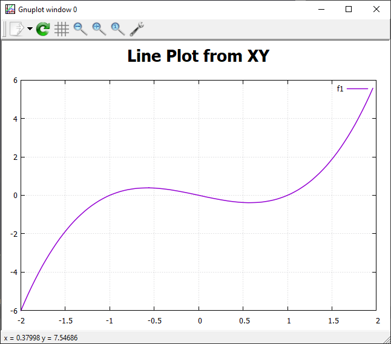

# **Welcome to Plotpp**

## **Plotpp**

A plotting library for C++ that uses Gnuplot as a backend.
Allows plotting from custom containers/vectors if they use `begin()` and `end()` iterators as well as plotting from built in arrays.

[Documentation](https://tobiaswallner.github.io/plotpp/)

## **Requirements**

- Gnuplot: [Homepage](http://gnuplot.info/index.html) [Windows Download](https://sourceforge.net/projects/gnuplot/files/gnuplot/) [Linux install](https://riptutorial.com/gnuplot/example/11275/installation-or-setup):  
	*Note: The project can be build without gnuplot,
	since this library will only communicate with gnuplot through pipes. 
	But you will need gnuplot to display the graphical plots.*
- C++20

## **Dependencies**

- {fmt}: [GitHub](https://github.com/fmtlib/fmt), [Documentation](https://fmt.dev/11.0/), [Conan](https://conan.io/center/recipes/fmt?version=)

A [conan](https://conan.io/) recipe is provided

## **Example**

=== "Code"
    ```cpp
	#include <vector>
	#include <plotpp.hpp>

	#include "functions.hpp" //linspace, apply_func

	int main() {
		
		std::vector<float> x = linspace<float>(-2, 2, 100);
		std::vector<double> y = apply_func(x, [](double x){return -x + x * x * x;});
		
		using namespace plotpp;
		
		Figure fig("Line Plot from XY");
		fig.add(line(&x, std::move(y)).label("f1"));
		fig.grid();
		fig.show();
		fig.save("line-plot.svg");
		
		return 0;
	}
	```

=== "Output"
    


## **Integration**

### **[CMake](https://cmake.org/)**

```cmake
cmake_minimum_required(VERSION 3.15)
project(PROJECT_NAME CXX)

find_package(plotpp CONFIG REQUIRED)

add_executable(main src/main.cpp)
target_link_libraries(main plotpp::plotpp)
```

### **CPM (CMake Package Manager)**

TODO

### **[Conan Package Manager](https://conan.io/)**

Note: not yet added to the [ConanCenter](https://conan.io/center)

=== "conanfile.txt"
	```ini
	[requires]
	plotpp/<version>

	[generators]
	CMakeDeps
	CMakeToolchain

	[layout]
	cmake_layout
	```

=== "conanfile.py"
	```py
	from conan import ConanFile
	from conan.tools.cmake import cmake_layout


	class ExampleRecipe(ConanFile):
		settings = "os", "compiler", "build_type", "arch"
		generators = "CMakeDeps", "CMakeToolchain"

		def requirements(self):
			self.requires("plotpp/<version>")

		def layout(self):
			cmake_layout(self)
	```

build instructions with conan
```bash
# install dependencies
conan install . --build=missing --output-folder build

# generate build scripts (for the build tool e.g.: -G "Ninja Multi-Config")
cmake -S . -B build -DBUILD_EXAMPLES=ON -DCMAKE_TOOLCHAIN_FILE=build/Release/generators/conan_toolchain.cmake

# build the project
cmake --build build_gcc --config Release
```

#### **Conan FAQ**
+ 	How can I make Conan use a different CMake generator?  
	Add to your profile:
```ini
[conf]
tools.cmake.cmaketoolchain:generator=Ninja
```
+	Conan selects the wrong compiler?
	Add to your profile:
```ini
[conf]
tools.build:compiler_executables={"c" : "gcc", "cpp" : "g++"}
```
+	Where can I find the default profile?
```bash
conan profile path default
```
+	I want to create a library but with `conan create . --build=missing` it cannot find the header files
	Enable transitive headers in your `conanfile.py`:
```py
def requirements(self):
	self.requires("<library/version>", transitive_headers=True)
```

### **Manually with [add_subdirectory](https://cmake.org/cmake/help/latest/command/add_subdirectory.html)**

Manually download the library and add it via `add_subdirectory`.
```cmake
add_subdirectory(path/to/Plotpp)
add_executable(PROJECT_NAME main.cpp)
target_link_libraries(YOUR_PROJECT_NAME PUBLIC plotpp)
```
Note: you would also need to add and link against fmt

### **Manual Build**

- include the folder containing `plotpp.hpp`
- compile and link all `*.cpp` files in `plotpp/`


