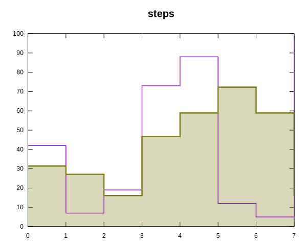
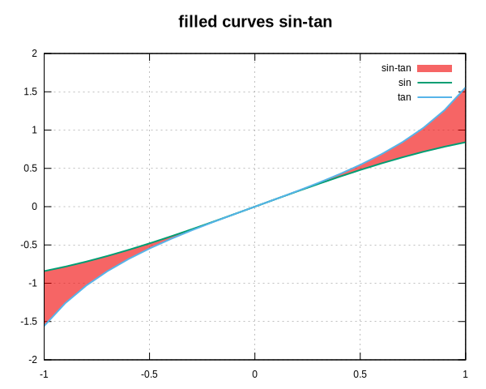
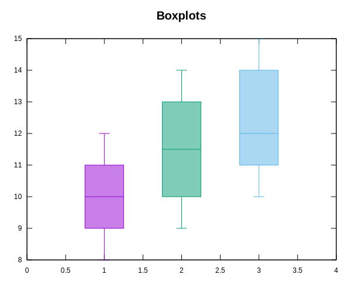
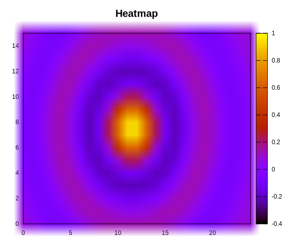
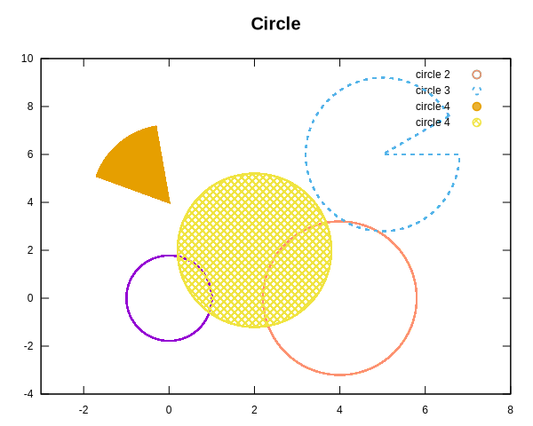
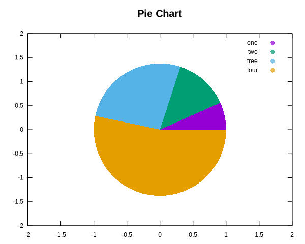
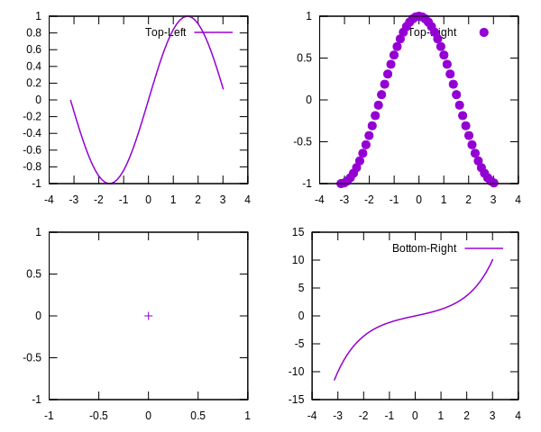
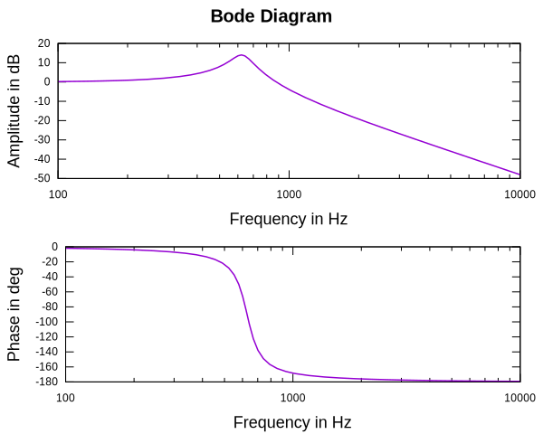

Plotting Styles
===============

-     

    ---
	**Line**  
	[Class Line](../API/Classes/classplotpp_1_1_line.md) | [Example](../API/Examples/line_8cpp-example.md)

-   

    ---
    **Point/Scatter**  
	[Class Points](../API/Classes/classplotpp_1_1_points.md) | [Example](../API/Examples/points_8cpp-example.md)
	

-	

    ---
	**Impulses**  
	[Class Impulses](../API/Classes/classplotpp_1_1_impulses.md) | [Example](../API/Examples/impulses_8cpp-example.md)

-	

    ---
	**Impulses**  
	[Class Impulses](../API/Classes/steps_1_1_impulses.md) | [Example](../API/Examples/steps_8cpp-example.md)

-	

    ---
	**XError**  
	[Class XError](../API/Classes/xerror_1_1_impulses.md) | [Example](../API/Examples/xerror_8cpp-example.md)

-	

    ---
	**YError**  
	[Class YError](../API/Classes/yerror_1_1_impulses.md) | [Example](../API/Examples/yerror_8cpp-example.md)
	

-	

    ---
	**XYError**  
	[Class YError](../API/Classes/xyerror_1_1_impulses.md) | [Example](../API/Examples/xyerror_8cpp-example.md)
	
	
	
-	

    ---
	**YErrorLine**  
	[Class YError](../API/Classes/yerrorline_1_1_impulses.md) | [Example](../API/Examples/yerrorline_8cpp-example.md)
	
-	

    ---
	**Filled Curve**  
	[Class FilledCurve](../API/Classes/filledcurves_1_1_boxes.md) | [Example](../API/Examples/filledcurves_8cpp-example.md)

-   
	
	---
    **Arrow/Vector/Quiver**  
	[Class Arrows](../API/Classes/classplotpp_1_1_arrows.md) | [Example](../API/Examples/arrows_8cpp-example.md)
	
	
-   

    ---  
    **Boxes**  
	[Class Boxes](../API/Classes/classplotpp_1_1_boxes.md) | [Example](../API/Examples/boxes_8cpp-example.md)

-	

    ---
	**Boxplot**  
	[Class Boxplot](../API/Classes/boxplot_1_1_boxes.md) | [Example](../API/Examples/boxplot_8cpp-example.md)
	
	
-	

    ---
	**Heatmap**  
	[Class Heatmap](../API/Classes/heatmap_1_1_boxes.md) | [Example](../API/Examples/heatmap_8cpp-example.md)
	
	
-	

    ---
	**Circle**  
	[Class Circle](../API/Classes/circle_1_1_boxes.md) | [Example](../API/Examples/circle_8cpp-example.md)	

	
-	

    ---
	**Piechart**  
	[Class Circle](../API/Classes/piechart_1_1_boxes.md) | [Example](../API/Examples/piechart_8cpp-example.md)

	
-	

    ---
	**Multi Plot**  
	[Class Circle](../API/Classes/multiplot_1_1_boxes.md) | [Example](../API/Examples/multiplot_8cpp-example.md)	
	
-	

	---
	**Bode Plot**  
	[Function bode()](../API/Namespaces/namespaceplotpp/#function-bode) | [Example](../API/Examples/bode_8cpp-example.md)

