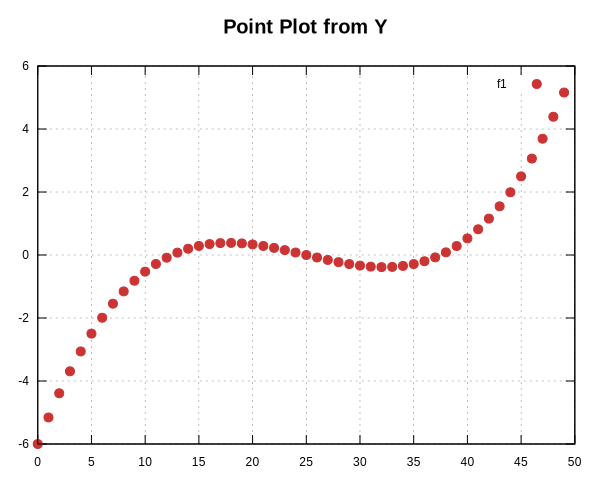

Plotting Styles
===============

-   

    ---
    
	**Line Plot**
	
	[Class Line](../API/Classes/classplotpp_1_1_line.md) | [Example](../API/Examples/line_8cpp-example.md)

-   

    ---

    **Point/Scatter Plot**  
	
	[Class Points](../API/Classes/classplotpp_1_1_points.md) | [Example](../API/Examples/points_8cpp-example.md)

